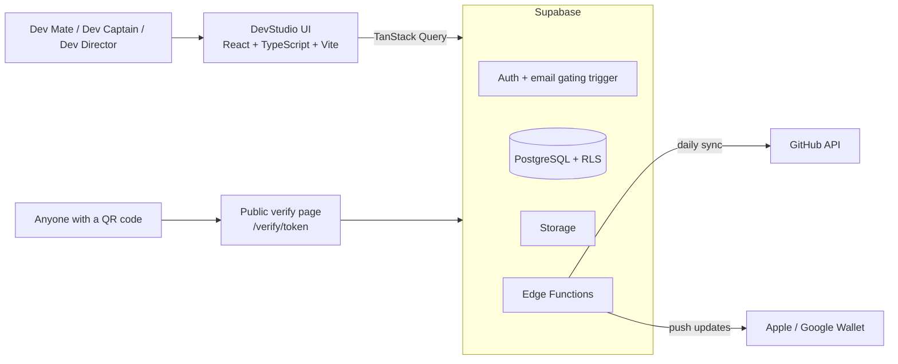

# 🧑‍💻 DevStudio

### Build. Ship. Learn.

**The student technology club platform for the Mangalore Institute of Technology & Engineering (MITE)**, centered on full-stack development and AI-assisted workflows.

DevStudio is a public marketing site, a member portal, a club management system, a developer-community hub, and a secure digital identity system in one product. It is designed to feel like a premium, developer-focused SaaS product rather than a generic college club portal.

🔗 **Live site:** [dev-studio-club.vercel.app](https://dev-studio-club.vercel.app/)

[Live site](https://dev-studio-club.vercel.app/) · [Report a bug](../../issues) · [Request a feature](../../issues)


---

## Table of contents

- [Highlights](#-highlights)
- [Tech stack](#-tech-stack)
- [User roles](#-user-roles)
- [Authentication & security](#-authentication--security)
- [Digital identity & wallet passes](#-digital-identity--wallet-passes)
- [Attendance](#-attendance)
- [Modules](#-modules)
- [Architecture](#-architecture)
- [Getting started](#-getting-started)
- [Deployment](#-deployment)
- [Project principles](#-project-principles)
- [Contributing](#-contributing)
- [Author](#-author)
- [License](#-license)

---

## ✨ Highlights

- 🪪 **Verifiable digital identity:** a unique DevStudio ID, a digital ID card, and real Apple/Google Wallet passes for every activated member
- 🔒 **Security enforced at the database:** email gating by Postgres trigger and authorization by Row Level Security, never client-side only
- ✅ **Fast, manual attendance:** everyone starts Present; organizers tap only the absentees
- 🚀 **Built for builders:** events, project hub, build challenges, GitHub stats, certificates, and a curated resource hub
- 🧾 **Full audit trail:** every administrative action is logged

---

## 🛠️ Tech stack

| Layer | Technology |
|---|---|
| **Frontend** | React, TypeScript, Vite |
| **Styling** | Tailwind CSS, shadcn/ui, Lucide icons, built on the Google Stitch design system |
| **Data layer** | TanStack Query, React Hook Form, Zod |
| **Auth & database** | Supabase: native Auth, PostgreSQL, Storage, Row Level Security |
| **Serverless** | Supabase Edge Functions (GitHub sync, wallet pass updates) |
| **Hosting** | Vercel |

---

## 👥 User roles

There are exactly **three roles**. The UI-facing names are fixed and must be used consistently across the product.

| UI name | Backend value | Responsibilities |
|---|---|---|
| **Dev Director** | `admin` | Full platform control |
| **Dev Captain** | `organizer` | Runs events, attendance, projects, and content |
| **Dev Mate** | `member` | Participates, builds, and learns |

- All users start with a **`pending`** status on signup and must be activated.
- There is **no "Team Lead" role.**

---

## 🔐 Authentication & security

| Rule | How it is enforced |
|---|---|
| **Strict email gating:** only `@mite.ac.in` emails can register | Server-side, via a Postgres trigger |
| **No client-side-only authorization** | Every protected action is enforced by Supabase **Row Level Security (RLS)** policies |
| **No fake data** | No seed data, fake accounts, or dummy entries; the database starts empty |
| **Auditability** | Admin actions, ID card changes, and attendance edits are all logged |

Because the database ships empty, **every screen must handle empty states gracefully.**

---

## 🪪 Digital identity & wallet passes

Every activated user receives a **DevStudio ID**, a **digital ID card**, and an **Apple / Google Wallet pass**.

### Two separate identifiers

| Identifier | Example | Purpose |
|---|---|---|
| **Public ID** | `DS26-0042` | Human-readable; generated safely from a Postgres sequence |
| **Verification token** | *(opaque, cryptographically random)* | Used in QR codes; never derivable from the public ID |

### Public verification

`/verify/<token>` is a public page that lets anyone confirm a card is authentic.

- Exposes only public details: **Name, Role, Status**
- Requests are **rate-limited**

### Wallet passes

Real Apple Wallet and Google Wallet passes are generated, and **updated via push notification** whenever a member's **role, status, or photo** changes.

---

## 📋 Attendance

Attendance is **strictly manual** and taken only by **Dev Captains or Dev Directors** during physical meetings.

- ❌ No self-check-in, no QR scanning, no self-marking
- ✅ Every member starts as **Present** when the session opens
- 👆 The organizer taps the names of the few absentees to toggle them to **Absent**
- 🧾 All attendance edits are audit-logged

---

## 🚀 Modules

| Module | What it does |
|---|---|
| 📅 **Events** | Full lifecycle from draft to completed, with team registration, capacity tracking, and organizer dashboards |
| 📢 **Announcements** | Categorized, prioritized, and pinned, with read-tracking |
| 🗂️ **Project Hub** | Lightweight team workspace with task boards: To Do, In Progress, Review, Completed |
| 🏆 **Build Challenges** | Competitions with timelines, team submissions (GitHub + live demo), and leaderboards |
| 🐙 **GitHub integration** | Members link their GitHub accounts; daily commit and repo stats sync to profiles and projects via an Edge Function |
| 🎖️ **Certificates & badges** | Professional, non-cartoonish badges for real achievements, plus verifiable certificates |
| 📚 **Resource Hub** | Management-curated resources across Full Stack, UI/UX, Deployment, and Cybersecurity |
| 🧾 **Audit logging** | Every administrative action, ID card change, and attendance edit is recorded |

---

## 🏛️ Architecture



---

## 🚀 Getting started

### Prerequisites

- Node.js 18+ and npm
- A [Supabase](https://supabase.com) project
- (Optional) the [Supabase CLI](https://supabase.com/docs/guides/cli) for migrations and Edge Functions

### 1. Clone and install

```bash
git clone <your-repository-url>
cd devstudio
npm install
```

### 2. Configure environment variables

```bash
cp .env.example .env
```

```env
# Exposed to the browser (safe: the anon key relies on RLS for protection)
VITE_SUPABASE_URL=your_supabase_project_url
VITE_SUPABASE_ANON_KEY=your_supabase_anon_key
```

> ⚠️ **Never** put the Supabase `service_role` key in any `VITE_` variable or client code. Secrets for Edge Functions (GitHub, wallet signing certificates) belong in Supabase function secrets, not in the frontend.

### 3. Set up the database

Apply the migrations to your Supabase project:

```bash
supabase link --project-ref <your-project-ref>
supabase db push
```

Migrations should create the schema, RLS policies, the `@mite.ac.in` email-gating trigger, and the ID sequence. **No seed data is included**, so the database starts empty by design.

### 4. Run locally

```bash
npm run dev
```

### 5. Build for production

```bash
npm run build
npm run preview
```

---

## ▲ Deployment

1. Push the project to GitHub.
2. Import the repository into [Vercel](https://vercel.com/new).
3. Add `VITE_SUPABASE_URL` and `VITE_SUPABASE_ANON_KEY` under **Project Settings → Environment Variables**.
4. Deploy the Edge Functions: `supabase functions deploy <function-name>`.
5. In the Supabase dashboard, confirm that **RLS is enabled on every table** and that the email-gating trigger is active.
6. Verify production (currently at [dev-studio-club.vercel.app](https://dev-studio-club.vercel.app/)): try signing up with a non-`@mite.ac.in` email (it must be rejected), and open a `/verify/<token>` page while signed out.

---

## 📐 Project principles

- **Premium, developer-first feel:** a polished SaaS experience, not a generic college portal
- **Database-enforced security:** if it isn't enforced by RLS or a trigger, it isn't enforced
- **Exactly three roles:** Dev Director, Dev Captain, Dev Mate, using the UI names consistently
- **No fake data, ever:** design for empty states
- **Real recognition:** badges and certificates reflect real achievements and stay professional
- **Everything is traceable:** sensitive changes are audit-logged

---

## 🤝 Contributing

Contributions from MITE members are welcome.

1. Create a branch: `git checkout -b feature/your-feature`
2. Follow the principles above (RLS for authorization, no seed data, correct role names)
3. Open a pull request describing what changed and why

---

## 👤 Author

**Karthik Prabhu**
B.E. Computer Science & Engineering student at the Mangalore Institute of Technology & Engineering (MITE), Moodabidri. Passionate about UI/UX design, web development, and emerging AI & web technologies.

[](https://www.linkedin.com/in/karthik-prabhu-aba603330)

---

## 📄 License

Add your license here and include a `LICENSE` file in the repository.

---

<p align="center"><b>DevStudio</b>: Build. Ship. Learn.<br/>Made by the student tech club at MITE, Mangalore.</p>
